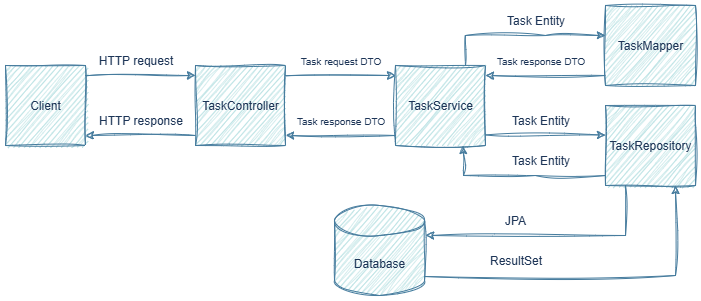

# ⚙️ Архитектура приложения

## Обзор архитектуры

Приложение построено по принципу [**слоистой архитектуры**](https://ru.wikipedia.org/wiki/Многоуровневая_архитектура#Распространённые_слои), 
которая обеспечивает разделение ответственности между компонентами.
Это классический подход для веб-приложений, следующий принципам [SOLID](https://ru.wikipedia.org/wiki/SOLID_(программирование)) и [DDD](https://ru.wikipedia.org/wiki/Предметно-ориентированное_проектирование).

Ниже представлена диаграмма взаимодействия слоёв:



Клиент отправляет [HTTP-запрос](https://ru.wikipedia.org/wiki/HTTP#Структура_HTTP-сообщения), который первым делом попадает в [контроллер](#controller). Здесь данные запроса оборачиваются
в специальный объект для передачи данных - [TaskRequest](#dto), который обеспечивает безопасность, проверяя и фильтруя
входящую информацию.

Далее TaskRequest передаётся в [сервисный слой](#service) (реализация TaskServiceImpl), где TaskMapper преобразует его в
сущность [Task](#entity). Затем подготовленная сущность сохраняется через [TaskRepository](#repository), который в зависимости от 
операции либо сохраняет сущность в базе данных без возврата результата, либо возвращает сущность с данными.

При возвращении данных сущность из репозитория передаётся в сервис, где [маппер](#mapper) преобразует её в DTO - 
[TaskResponse](#dto), а контроллер затем формирует из DTO финальный HTTP-ответ.

## Описание и структура слоев

### 1. Слой представления

<a name="controller"></a>
#### 1. Контроллер 

**Пакет:** `com.example.taskmanager.controller`

**Основная задача:** обработка HTTP-запросов и возврат HTTP-ответов.

**Компоненты:**   

**`TaskController`** - компонент, который обеспечивает обработку HTTP-запросов для управления задачами. 
Контроллер содержит 5 основных методов, каждый из которых имеет свой [тип](https://ru.wikipedia.org/wiki/HTTP#Методы), конечную точку и определенную задачу. 

**Методы `TaskController`:**

| Название метода |  Тип   |   Конечная точка   |        Описание        |
|:---------------:|:------:|:------------------:|:----------------------:|
|    `getTask`    |  GET   | `/api/tasks/{id}`  | Получение задачи по ID |
|   `getTasks`    |  GET   |    `/api/tasks`    |  Получение всех задач  |
|  `createTask`   |  POST  |    `/api/tasks`    |     Создать задачу     |
|  `updateTask`   |  PUT   | `/api/tasks/{id}`  | Обновить задачу по ID  |
|  `deleteTask`   | DELETE | `/api/tasks/{id}`  |  Удалить задачу по ID  |

**Основные функции контролера:**

* Обработка HTTP-запросов (GET, POST, PUT, DELETE)
* Валидация поступающих на вход данных
* Вызов методов сервисного слоя
* Возврат HTTP-ответов
* Описание методов API посредством аннотаций Swagger (`@Tag`, `@Operation`, `@ApiResponses`, `@ApiResponse`, `@Parameter`)

**Наилучшие подходы проектирования:**

1. Отделение API от сущностей БД посредством DTO `TaskRequest` и `TaskResponse`
2. Применение аннотаций валидации (`@Valid`)
3. Использование конкретных маппингов для каждого метода (`@GetMapping`, `@PostMapping`, `@PutMapping`, `@DeleteMapping`) вместо `@RequestMapping`
4. Централизованная обработка ошибок через `@RestControllerAdvice`

**Пример кода:**

```java
@RestController
@RequestMapping("/api/tasks")
public class TaskController {
    private final TaskService taskService;

    public TaskController(TaskService taskService) {
        this.taskService = taskService;
    }

    @GetMapping("/{id}")
    public ResponseEntity<TaskResponse> getTask(@PathVariable Long id) {
        return ResponseEntity.ok(taskService.getTask(id));
    }
}
```

<hr>

<a name="dto"></a>
#### 2. DTO

**Пакет:** `com.example.taskmanager.dto`

**Основная задача:** изоляция API от внутренней структуры данных.

**Компоненты:**

* **`TaskRequest`** - DTO для входящих данных
* **`TaskResponse`** - DTO для исходящих данных
* **`ApiError`** - класс, определяющий единый формат ответа об ошибках

<a name="tasreq_taskresp"></a>
**`TaskRequest` / `TaskResponse`**

Классы `TaskRequest` и `TaskResponse` - это специализированные классы для передачи данных, которые обеспечивают 
безопасность при передаче между разными слоями приложения. `TaskRequest` скрывает входящие данные от клиента, а 
`TaskResponse` определяет какие именно данные вернутся клиенту.

**Структура `TaskRequest`:**

|     Поле      |             Тип             |    Описание     |
|:-------------:|:---------------------------:|:---------------:|
|    `title`    |          `String`           | Название задачи |
| `description` |          `String`           | Описание задачи |
|   `status`    |  [TaskStatus](#taskstatus)  |  Статус задачи  |

**Пример кода `TaskRequest`:**

```java
@Schema(description = "Request for creating or updating a task")
public record TaskRequest(
        @Schema(description = "Task title", example = "Write API documentation")
        @NotBlank(message = "Title is required")
        @Size(min = 1, max = 100, message = "Title must be between 1 and 100 characters")
        String title,

        @Schema(description = "Task description", example = "Create comprehensive API docs")
        @Size(max = 500, message = "Description cannot exceed 500 characters")
        String description,

        @Schema(description = "Task status", example = "IN_PROGRESS")
        @NotNull(message = "Status is required")
        TaskStatus status
) {}
```

**Структура `TaskResponse`:**

|     Поле      |                                           Тип                                            |       Описание        |
|:-------------:|:----------------------------------------------------------------------------------------:|:---------------------:|
|     `id`      |                                          `Long`                                          | Идентификатор задачи  |
|    `title`    |                                         `String`                                         |    Название задачи    |
| `description` |                                         `String`                                         |    Описание задачи    |
|   `status`    |                                       `TaskStatus`                                       |     Статус задачи     |
|  `createdAt`  | [LocalDateTime](https://docs.oracle.com/javase/8/docs/api/java/time/LocalDateTime.html)  | Время создания задачи |


**Пример кода `TaskResponse`:**

```java
@Schema(description = "Task response data")
public record TaskResponse(
        @Schema(description = "Task ID", example = "1")
        Long id,

        @Schema(description = "Task title", example = "Write API documentation")
        String title,

        @Schema(description = "Task description", example = "Create comprehensive API docs")
        String description,

        @Schema(description = "Task status", example = "IN_PROGRESS")
        TaskStatus status,

        @Schema(description = "Creation timestamp")
        LocalDateTime createdAt
) {}
```

В классах `TaskRequest` и `TaskResponse` к каждому полю применены аннотации (`@Shema`) для их описания в Swagger, а также 
в `TaskRequest` используются аннотации для проверки данных (`@NotBlank`, `@Size`, `@NotNull`).

**`ApiError`**

Класс `ApiError` - это [POJO-класс](https://ru.wikipedia.org/wiki/POJO), который также является DTO для передачи 
информации об ошибках в едином формате.

**Структура `ApiError`:**

|        Поле        |           Тип           |                     Описание                     |
|:------------------:|:-----------------------:|:------------------------------------------------:|
|    `timestamp`     |     `LocalDateTime`     |            Время возникновения ошибки            |
|      `status`      |          `int`          |                Код состояния HTTP                |
|      `error`       |        `String`         |                 Описание статуса                 |
|     `message`      |        `String`         |          Подробное сообщение об ошибке           |
|       `path`       |        `String`         |      Маршрут, по которому произошла ошибка       |
| `validationErrors` | `List<ValidationError>` | Список, отражающий различные нарушения валидации |

**Пример кода `ApiError`:**

```java
public class ApiError {
    private LocalDateTime timestamp;
    private int status;
    private String error;
    private String message;
    private String path;
    
    @JsonInclude(JsonInclude.Include.NON_NULL)
    private List<ValidationError> validationErrors;

    public ApiError() {
    }
   ...
```
В `ApiError` используется аннотация `@JsonInclude(JsonInclude.Include.NON_NULL)` на поле validationErrors, 
которая в случае отсутствия ошибок валидации исключает это поле из ответа в возвращаемом JSON.

Подробнее о DTO изложено в разделе [DTO-паттерн](02_dto_pattern.md).

<hr>

### 2. Слой бизнес-логики

<a name="service"></a>
#### Service

**Пакет:** `com.example.taskmanager.service`

**Основная задача:** реализация бизнес-логики приложения.

**Компоненты:**

* **`TaskService`** - интерфейс, описывающий основной набор методов, предназначенных для управления задачами.
* **`TaskServiceImpl`** - класс, содержащий реализацию методов, описанных в TaskService.

**Основные функции `TaskServiceImpl`:**

* Преобразование из Entity в DTO / из DTO в Entity при помощи [TaskMapper](#mapper)
* Управление транзакциями (аннотация `@Transactional`)
* Генерация исключений

**Наилучшие подходы проектирования:**

1. Применение [полиморфизма](https://ru.wikipedia.org/wiki/Полиморфизм_(информатика)) через разделение классов на интерфейсы и их реализации.
2. Соблюдение принципа [SRP](https://ru.wikipedia.org/wiki/Принцип_единственной_ответственности) - класс `TaskServiceImpl`
отвечает только за реализацию бизнес-логики, а каждый метод класса выполняет только одну задачу.
3. Соблюдение принципа [DIP](https://ru.wikipedia.org/wiki/Принцип_инверсии_зависимостей) - обеспечивает зависимость
сервиса от интерфейсов (`TaskRepository`, `TaskMapper`), а не их реализаций. Внедрение зависимостей происходит через конструктор, а не поля. 
4. Изоляция бизнес-логики от деталей HTTP и базы данных

**Пример кода `TaskServiceImpl`:**

```java
    @Service
    public class TaskServiceImpl implements TaskService {
    
        private final TaskRepository taskRepository;
        private final TaskMapper taskMapper;
    
        public TaskServiceImpl(TaskRepository taskRepository, TaskMapper taskMapper) {
            this.taskRepository = taskRepository;
            this.taskMapper = taskMapper;
        }

        @Transactional
        @Override
        public TaskResponse updateTask(Long id, TaskRequest taskRequest) {
           try {
              Task task = taskRepository.findById(id).orElseThrow(() -> new ResourceNotFoundException("Task not found with id: " + id));
              taskMapper.updateEntityFromDto(taskRequest, task);
              Task updatedTask = taskRepository.save(task);
              return taskMapper.entityToDTO(updatedTask);
           } catch (DataAccessException e) {
              throw new InternalServerException("Failed to update task due to database error", e);
           }
        }
    }
```

!!! note "Примечание"
    Аннотация `@Transactional` обеспечивает атомарность выполнения операций с базой данных. Она гарантирует, что все 
    операции будут либо выполнены полностью, либо произойдёт откат операций при возникновении ошибки, если исключение [непроверяемое](https://docs.oracle.com/javase/tutorial/essential/exceptions/runtime.html).

### 3. Слой доступа к данным

<a name="entity"></a>
#### 1. Модели/Сущности

**Пакет:** `com.example.taskmanager.model`

**Основная задача:** представление сущностей и их связывание с базой данных.

**Компоненты:**

* **`Task`** - сущность задачи
* **`TaskStatus`** - enum для статусов задачи
<a name="taskstatus"></a>
``
**`Task`** - это [JPA-сущность](https://ru.wikipedia.org/wiki/Java_Persistence_API#Entity), в которой описана модель задачи. Она также ассоциирована с таблицей `tasks` в базе данных.

**Используемые аннотации:**

|     Название      |                                  Назначение                                   |
|:-----------------:|:-----------------------------------------------------------------------------:|
|     `@Entity`     |              Помечает класс как JPA-сущность для сохранения в БД              |
|     `@Table`      |                          Указывает имя таблицы в БД                           |
|       `@Id`       |         Используется для обозначения поля в качестве первичного ключа         |
| `@GeneratedValue` |                  Автоинкремент id с выбором разных стратегий                  |
|     `@Column`     | Сопоставление различных атрибутов и ограничений поля со столбцом таблицы в БД |
|   `@Enumerated`   |             Сопоставления поля типа Enum со столбцом таблицы в БД             |
|   `@PrePersist`   | Указывается над методом, который будет вызван перед сохранением новой записи  |

**Структура `Task`:**

|     Поле      |       Тип       |       Описание        |
|:-------------:|:---------------:|:---------------------:|
|     `id`      |     `Long`      | Идентификатор задачи  |
|    `title`    |    `String`     |    Название задачи    |
| `description` |    `String`     |    Описание задачи    |
|   `status`    |  `TaskStatus`   |     Статус задачи     |
|  `createdAt`  | `LocalDateTime` | Время создания задачи |

**Пример кода `Task`:**

```java
@Entity
@Table(name = "tasks")
public class Task {
    @Id
    @GeneratedValue(strategy = GenerationType.IDENTITY)
    private Long id;

    @Column(nullable = false, length = 100)
    private String title;

    @Enumerated(EnumType.STRING)
    @Column(nullable = false)
    private TaskStatus status;

    @PrePersist
    protected void onCreate() {
        createdAt = LocalDateTime.now();
    }
}
```

**`TaskStatus`** - это `Enum`, который определяет набор возможных статусов задачи.

**Структура `TaskStatus`:**

|    Статус     |           Описание           |
|:-------------:|:----------------------------:|
|    `TODO`     | Задача создана, но не начата |
| `IN_PROGRESS` |       Задача в работе        |
|    `DONE`     |       Задача выполнена       |

**Пример кода TaskStatus:**

```java
public enum TaskStatus {
    TODO,
    IN_PROGRESS,
    DONE
}
```

<a name="repository"></a>
#### 2. Репозиторий

**Пакет:** `com.example.taskmanager.repository`

**Основная задача:** абстракция, промежуточный слой для доступа к данным.

**Компоненты:**

* **`TaskRepository`** - интерфейс, который предоставляет встроенный набор методов 
для управления сущностями, а также служит прослойкой между базой данных и сервисным слоем.

**Основные функции:**

* CRUD-операции над сущностями
* Абстракция работы с БД
* Возможность генерации запросов из имен методов
* Возможность применения пользовательских SQL/[JPQL](https://ru.wikipedia.org/wiki/Java_Persistence_Query_Language) запросов

**Наилучшие подходы проектирования:**

* Использование Spring Data JPA для минимизации повторяющегося кода
* Изоляция JPA, которая обеспечивает работу репозитория только с Entity-классами

**Пример кода `TaskRepository`:**

```java
    @Repository
    public interface TaskRepository extends JpaRepository<Task, Long> {}
```

Интерфейс `TaskRepository` [наследуется](https://ru.wikipedia.org/wiki/Наследование_(программирование)) от интерфейса [JpaRepository](https://docs.spring.io/spring-data/jpa/docs/current/api/org/springframework/data/jpa/repository/JpaRepository.html), который в свою очередь предоставляет готовый 
набор методов для управления сущностями в базе данных. На примере кода также видно, что `JpaRepository` работает с 
сущностью типа `Task`, а тип первичного ключа этой сущности - `Long`.

<hr>

### 4. Инфраструктурный слой

<a name="mapper"></a>
#### 1. Маппер

**Пакет:** `com.example.taskmanager.mapper`

**Основная задача:** преобразование объектов между слоями приложения для изоляции различных представлений данных.

**Компоненты:**

* **`TaskMapper`** - интерфейс, который описывает методы преобразования между сущностями (`Task`) и DTO (`TaskRequest`, `TaskResponse`)
* **`TaskMapperImpl`** - реализация интерфейса `TaskMapper`

**Основные функции:**

* Преобразование Entity в DTO для возврата клиенту
* Преобразование DTO в Entity для сохранения в БД
* Обновление существующих Entity из DTO
* Изоляция логики преобразования данных

**Наилучшие подходы проектирования:**

* Маппер отвечает только за преобразование данных (принцип SRP).
* Бизнес-логика не зависит от деталей преобразования, тем самым обеспечивая изоляцию зависимостей.
* Централизованная логика маппинга.

**Методы `TaskMapper`:**

|    Название метода    | Тип возвращаемого значения |              Параметры метода              |                             Описание                              |
|:---------------------:|:--------------------------:|:------------------------------------------:|:-----------------------------------------------------------------:|
|     `entityToDTO`     |       `TaskResponse`       |                `Task task`                 |           Преобразование из сущности <br>`Task`  в DTO            |
|     `dtoToEntity`     |           `Task`           |         `TaskRequest taskRequest`          |           Преобразование из DTO <br> в сущность `Task`            |
| `updateEntityFromDto` |           `void`           | `TaskRequest taskRequest`,<br> `Task task` | Обновление сущности `Task` <br> из DTO (для метода `updateTask`)  |

**Пример кода `TaskMapper`:**

```java
@Component
public class TaskMapper {

   public TaskResponse entityToDTO(Task task) {
      return new TaskResponse(
              task.getId(),
              task.getTitle(),
              task.getDescription(),
              task.getStatus(),
              task.getCreatedAt()
      );
   }

   public Task dtoToEntity(TaskRequest taskRequest) {
      Task task = new Task();
      task.setTitle(taskRequest.title());
      task.setDescription(taskRequest.description());
      task.setStatus(taskRequest.status());
      return task;
   }

   public void updateEntityFromDto(TaskRequest taskRequest, Task task) {
      if (taskRequest.title() != null) {
         task.setTitle(taskRequest.title());
      }
      if (taskRequest.description() != null) {
         task.setDescription(taskRequest.description());
      }
      if (taskRequest.status() != null) {
         task.setStatus(taskRequest.status());
      }
   }
}
```

#### 2. Конфигурация

**Пакет:** `com.example.taskmanager.configuration`

**Основная задача:** централизованная настройка компонентов приложения.

**Компоненты:**

**`OpenApiConfig`** - конфигурация документации API с использованием OpenAPI

**Основные функции:**

* Централизованное управление настройками приложения
* Конфигурация документации

**Наилучшие подходы проектирования:**

* Выделенный слой для сбора конфигурации в одном месте обеспечивает централизацию настроек.
* Простота поддержки достигается за счёт легкого изменения настроек без модификации бизнес-логики.

**`OpenApiConfig`** - это класс конфигурации, который настраивает автоматическую генерацию OpenAPI документации.

**Аннотации `OpenApiConfig`:**

|       Название       |                          Назначение                           |
|:--------------------:|:-------------------------------------------------------------:|
|   `@Configuration`   |            Помечает класс как конфигурационный бин            |
| `@OpenAPIDefinition` |                   определяет метаданные API                   |
|       `@Info`        | Используется для обозначения поля в качестве первичного ключа |

Аннотация `@Info` использует внутри себя несколько атрибутов:

* `title` - для названия API
* `version` - для обозначения версии API
* `description` - для описания API

**Пример кода `OpenApiConfig`:**

```java
@Configuration
@OpenAPIDefinition(
    info = @Info(
        title = "Task Manager API",
        version = "1.0.0",
        description = "REST API for managing tasks with full CRUD operations"
    )
)
public class OpenApiConfig {}
```

#### 3. Обработка исключений

**Пакет:** `com.example.taskmanager.exception`

**Основная задача:** централизованная обработка исключений и преобразование их в стандартизированные HTTP-ответы.

**Компоненты:**

* **`GlobalExceptionHandler`** - центральный обработчик исключений
* **`ResourceNotFoundException`** - исключение для не найденных ресурсов
* **`WrongRequestException`** - исключение для некорректных запросов
* **`InternalServerException`** - исключение для внутренних ошибок сервера

**Основные функции:**

* Перехват и обработка исключений на уровне контроллера
* Преобразование исключений в стандартизированные JSON-ответы
* [Логирование](https://ru.wikipedia.org/wiki/Файл_журнала) ошибок
* Предоставление клиенту понятных сообщений об ошибках

**Наилучшие подходы проектирования:**

* Единая точка обработки исключений
* Стандартизированный формат ответов
* Разделение ответственности между слоями
* Для безопасности детали ошибок не раскрываются клиенту
* Логирование ошибок для отладки

**`GlobalExceptionHandler`** - это централизованный обработчик исключений, который перехватывает и обрабатывает исключения, а затем преобразует их в стандартизированные JSON-ответы.

**Методы `GlobalExceptionHandler`:**

|           Название метода            |     Обрабатываемые исключения     |       Описание исключения       |
|:------------------------------------:|:---------------------------------:|:-------------------------------:|
|  `handleResourceNotFoundException`   |    `ResourceNotFoundException`    | Запрашиваемый ресурс не найден  |
|    `handleWrongRequestException`     |      `WrongRequestException`      | Некорректный запрос от клиента  |
|   `handleInternalServerException`    |     `InternalServerException`     |    Внутренняя ошибка сервера    |
|     `handleValidationExceptions`     | `MethodArgumentNotValidException` |  Ошибка валидации объектов DTO  |
| `handleConstraintViolationException` |  `ConstraintViolationException`   | Нарушения ограничений валидации |
|     `handleAllUncaughtException`     |            `Exception`            |   Обработка разных исключений   |

В `GlobalExceptionHandler` есть 2 вспомогательных метода - `getRequestPath`, который извлекает путь [URI](https://ru.wikipedia.org/wiki/URI) из 
HTTP-запроса для включения в информацию об ошибке, а также `createApiError`, который создаёт объект `ApiError`, 
для формирования структуры ошибки.

**Аннотации `GlobalExceptionHandler`:**

|         Название         |                             Назначение                             |
|:------------------------:|:------------------------------------------------------------------:|
| `@RestControllerAdvice`  |    Позволяет централизовать обработку исключений в одном классе    |
|   `@ExceptionHandler`    | Позволяет обрабатывать исключения на уровне отдельного контроллера |

Также в `GlobalExceptionHandler` присутствует поле `Logger log`, используемое для логирования исключений.

**Пример кода `GlobalExceptionHandler`:**

```java
@RestControllerAdvice
public class GlobalExceptionHandler {

   private static final Logger log = LoggerFactory.getLogger(GlobalExceptionHandler.class);

   @ExceptionHandler(ResourceNotFoundException.class)
   public ResponseEntity<ApiError> handleResourceNotFoundException(ResourceNotFoundException ex, WebRequest request) {
      ApiError apiError = createApiError(HttpStatus.NOT_FOUND, "Resource Not Found", ex.getMessage(), request);
      log.warn("Resource not found: {}", ex.getMessage());
      return new ResponseEntity<>(apiError, HttpStatus.NOT_FOUND);
   }

   @ExceptionHandler(MethodArgumentNotValidException.class)
   public ResponseEntity<ApiError> handleValidationExceptions(MethodArgumentNotValidException ex, WebRequest request) {
      List<ApiError.ValidationError> validationErrors = ex.getBindingResult()
              .getFieldErrors()
              .stream()
              .map(error -> new ApiError.ValidationError(
                      error.getField(),
                      error.getDefaultMessage(),
                      error.getRejectedValue()
              ))
              .collect(Collectors.toList());

      ApiError apiError = new ApiError(
              LocalDateTime.now(),
              HttpStatus.BAD_REQUEST.value(),
              "Validation Failed",
              "Validation failed for one or more fields",
              getRequestPath(request)
      );
      apiError.setValidationErrors(validationErrors);
      log.warn("Validation failed: {}", validationErrors);
      return new ResponseEntity<>(apiError, HttpStatus.BAD_REQUEST);
   }
}
```
**Пример пользовательского исключения `WrongRequestException`:**

```java
@ResponseStatus(HttpStatus.BAD_REQUEST)
public class WrongRequestException extends RuntimeException{

    public WrongRequestException(String message) {
        super(message);
    }

    public WrongRequestException(String message, Throwable cause) {
        super(message, cause);
    }

}
```

**Пример стандартизированного ответа об ошибке:**

```json
{
    "timestamp": "2025-10-10T16:36:02.95536",
    "status": 400,
    "error": "Validation Failed",
    "message": "Validation failed for one or more fields",
    "path": "/api/tasks",
    "validationErrors": [
        {
            "field": "title",
            "message": "Title is required",
            "rejectedValue": null
        }
    ]
}
```

<hr>
